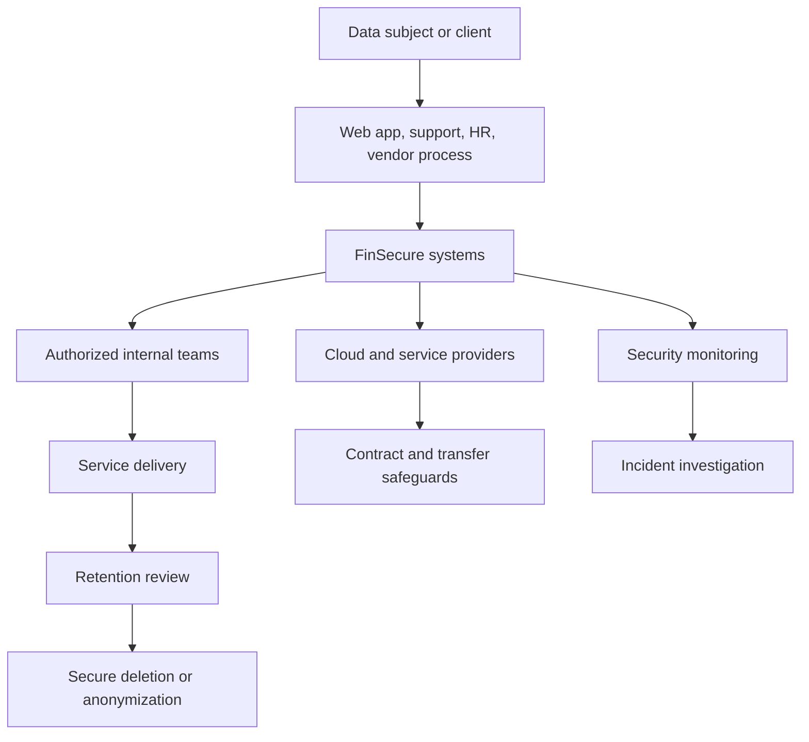

# Conceptual Data Flow

```mermaid
flowchart TD
 A[Data subject or client] --> B[Web app, support, HR, vendor process]
 B --> C[FinSecure systems]
 C --> D[Authorized internal teams]
 C --> E[Cloud and service providers]
 C --> F[Security monitoring]
 D --> G[Service delivery]
 E --> H[Contract and transfer safeguards]
 G --> I[Retention review]
 F --> J[Incident investigation]
 I --> K[Secure deletion or anonymization]
```
Conceptual only. Confirm actual sources, purposes, systems, access, recipients, transfers, retention, and deletion.
